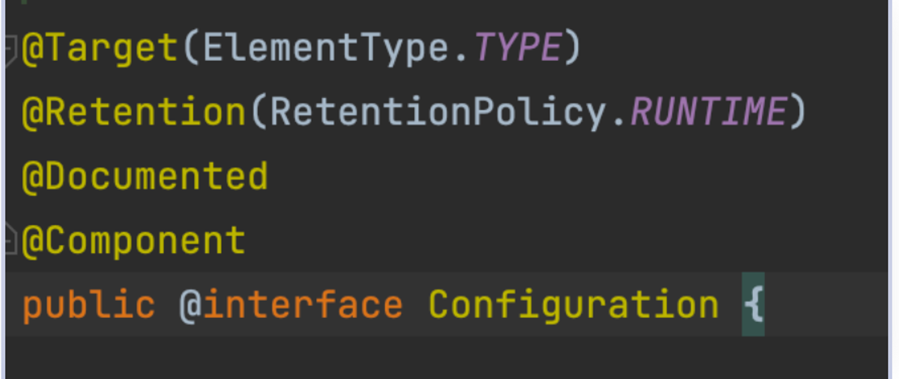

# Configuration

> ### GPT
> Spring Boot 에서는 자바 클래스에 @Configuration 애너테이션을 사용하여 **설정 클래스**를 정의할 수 있음
> ~~~
> import org.springframework.context.annotation.Bean;
> import org.springframework.context.annotation.Configuration;
> 
> @Configuration
> public class MyConfiguration {
> 
>   @Bean
>   public MyService myService() {
>       return new MyServiceImpl();
>   }
> }
> ~~~
> - 위 예제에서 'MyConfiguration' 클래스는 설정 클래스이며, 'myService' 메소드는 빈(bean) 정의를 포함하고 있음
> - '@Bean' 애너테이션은 이 메소드가 Spring 컨텍스트에서 관리하는 빈을 생성한다고 명시
- 이 때, 메서드 이름으로 bean 의 이름이 결정됨
- 스프링 컨테이너는 @Configuration 이 붙어 있는 클래스를 자동으로 빈으로 등록 -> 해당 클래스를 파싱해서 @Bean 이 있는 메서드를 찾아서 bean 을 생성
- @Configuration 안에서 @Bean 을 사용해야 **싱글톤을 보장받을 수 있음**

  - Spring 은 이러한 클래스들을 **프록시**로 감싸서 **싱글통 빈**을 생성하고, 이를 통해 같은 빈을 여러 번 요청하더라도 항상 동일한 인스턴스를 반환
    - 이러한 동작은 Spring 의 CGLIB 프록시 메커니즘에 의해 이루어짐
  - 예시
    ~~~
    import org.springframework.context.annotation.Bean;
    import org.springframework.context.annotation.Configuration;

    @Configuration
    public class MyConfiguration {
    
      @Bean
      public MyService myService() {
        return new MyServiceImpl();
      }

      @Bean
      public AnotherService anotherService() {
        return new AnotherServiceImpl(myService());
      }
    }
    ~~~
    - 'anotherService' 빈은 'myService' 빈을 주입받음
    - Spring 은 'myService()' 메소드를 여러 번 호출해도 동일한 인스턴스를 반환하므로 'anotherService' 와 'myService' 는 같은 'MyServiceImpl' 인스턴스를 참조하게 됨 
    - 하지만, '@Configuration' 을 사용하지 않고 일반 클래스에서 '@Bean' 을 정의할 경우, 싱글톤 보장이 되지 않음
    ~~~
    import org.springframework.context.annotation.Bean;

    public class MySimpleConfig {
    
      @Bean
      public MyService myService() {
        return new MyServiceImpl();
      }

      @Bean
      public AnotherService anotherService() {
        return new AnotherServiceImpl(myService());
      }
    }
    ~~~
    - 이 경우 'myService()' 메소드가 호출될 때마다 새로운 'MyServiceImpl' 인스턴스가 생성됨
    - 따라서, 'anotherService' 는 항상 새로운 'MyServiceImpl' 인스턴스를 주입받게됨
  - 따라서, '@Bean' 메소드가 싱글톤으로 동작하도록 보장하기 위해서는 반드시 해당 메소드들을 '@Configuration' 클래스 안에 정의해야 함

## 프록시
- 프록시는 원래 객체에 대한 대리자 역할을 하는 객체
- 프록시는 원래 객체에 대한 접근을 제어하거나 추가 기능을 제공하기 위해 사용됨
- 위 코드에서 'MyConfiguration' 클래스는 프록시로 감싸짐
### 프록시로 감싸는 이유
- Spring 에서 '@Configuration' 클래스를 프록시로 감싸는 이유는 '@Bean' 메소드의 호출이 싱글톤 빈을 보장하기 위해서 -> 내부에서 여러번 호출되는 '@Bean' 메소드가 항상 동일한 인스턴스를 반환하도록 함
1. 싱글톤 보장:
   - Spring 의 기본 빈 스코프는 싱글톤임. '@Configuration' 클래스의 '@Bean' 메소드를 프록시로 감싸면, Spring 은 해당 메소드가 여러번 호출될 때마다 새로운 객체를 생성하지 않고 이미 생성된 동일한 인스턴스를 반환할 수 있음
2. 순환 의존성 해결:
   - 프록시를 사용하면 빈 생성 순서를 관리하기 쉬워지고, 순환 의존성 문제를 해결하는 데 도움이 됨
   - 만약 'A' 가 'B' 를, 'B' 가 'A' 를 필요로 하는 상황이 있다면, 프록시를 사용하여 'A' 와 'B' 를 생성하는 동안 서로 참조할 수 있게 함
3. 효율적인 메모리 사용:
   - 싱글톤 빈을 사용하면 애플리케이션 컨텍스트 내에서 동일한 객체를 반복해서 사용하기 때문에 메모리 사용량을 줄이고, 애플리케이션 성능을 향상시킴
   - 프록시를 사용하여 이러한 싱글톤 패턴을 구현하면 불필요한 객체 생성을 피할 수 있음
4. 관리 및 유지보수 용이:
   - 프록시를 사용하면 Spring 컨테이너가 빈의 생명 주기를 더 잘 관리할 수 있음. 빈 초기화, 의존성 주입, 라이프사이클 인터페이스의 호출 등을 프록시가 효율적으로 처리할 수 있음
   - 이렇게 하면 코드의 복잡성을 줄이고 유지보수를 더 쉽게 할 수 있음
### 예제
~~~
@Configuration
public class AppConfig {

    @Bean
    public MyService myService() {
        return new MyServiceImpl();
    }

    @Bean
    public AnotherService anotherService() {
        return new AnotherServiceImpl(myService());
    }
}
~~~
- 'anotherService' 메서드는 'myService' 메서드를 호출. 'AppConfig' 클래스는 프록시로 감싸져 있기 때문에 'myService' 메서드 호출이 새로운 인스턴스를 생성하는 대신 이미 생성된 'MyServiceImpl' 빈을 반환함
~~~
[AppConfig Proxy]
      |
      +--- myService() --> [MyServiceImpl instance]
      |
      +--- anotherService() --> [AnotherServiceImpl instance]
                                |
                                +--> uses [MyServiceImpl instance]
~~~
1. [AppConfig Proxy]:
- 'AppConfig' 클래스는 '@Configuration' 어노테이션이 붙어 있기 때문에 Spring 이 프록시 객체로 감쌈. **이 프록시는 '@Bean' 메서드 호출을 가로채어 이미 생성된 빈이 있는 경우 이를 반환함**
2. myService() --> [MyServiceImpl instance]:
- 'myService()' 메서드가 처음 호출될 때, 새로운 'MyServiceImpl' 인스턴스를 생성함. 이 인스턴스는 Spring **컨테이너**에 의해 저장되며, 이후 호출에서도 동일한 인스턴스를 반환함
- 즉, 'myService()' 메서드를 호출하면 항상 동일한 '[MyServiceImpl instance]' 를 반환함
3. anotherService() --> [AnotherServiceImpl instance]:
- 'anotherService()' 메서드가 호출될 때, 새로운 'AnotherServiceImpl' 인스턴스를 생성함
- 이 때, 'AnotherServiceImpl' 생성자에 'myService()' 메서드를 호출하여 'MyServiceImpl' 인스턴스를 주입함. 프록시가 이미 저장된 '[MyServiceImpl instance]' 를 반환하므로 동일한 인스턴가 사용됨
4. uses [MyServiceImpl instance]:
- 결과적으로, 'AnotherServiceImpl' 인스턴스는 '[MyServiceImpl instance]' 를 참조하게 됨. 이는 동일한 'MyServiceImpl' 인스턴스가 여러 빈에서 사용된다는 것을 의미